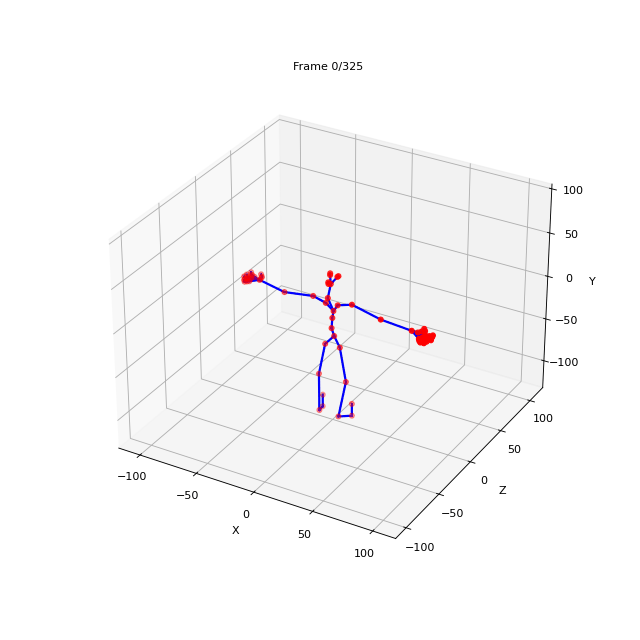
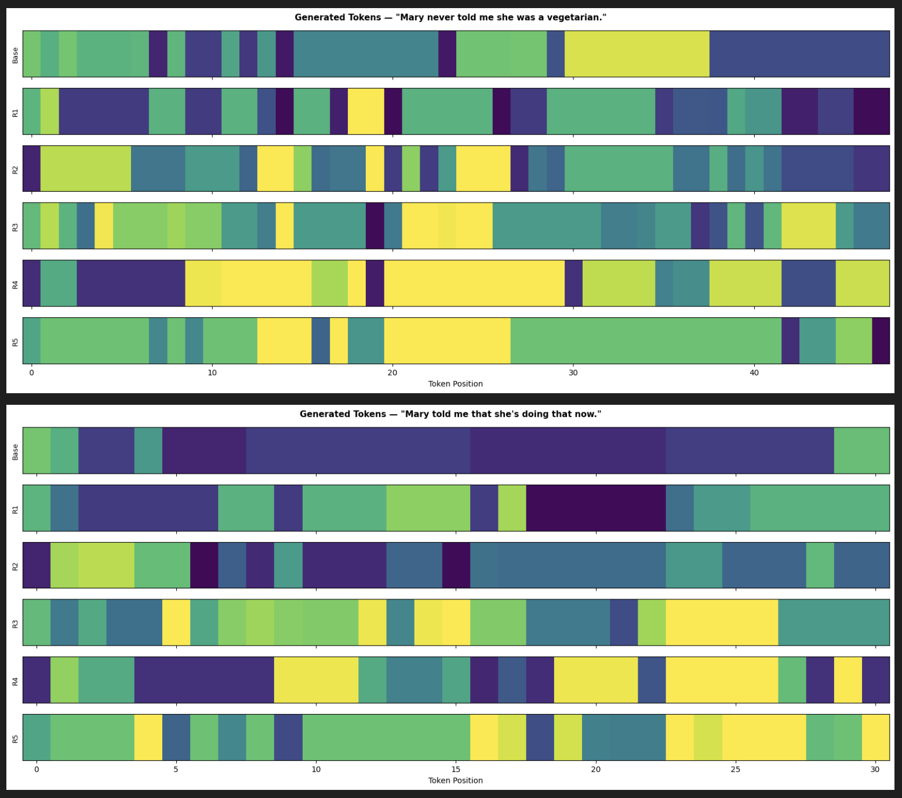

# Motion-S: Text-to-Sign Motion Generation

> Kaggle competition — hierarchical text-to-sign-language 3D motion generation using masked transformers and residual vector quantization.





---

## What it does

Takes a sentence + gloss as input and generates a 6-layer hierarchical sequence of motion tokens that reconstruct a 3D sign language animation via BVH skeleton.

```
"She is washing her hands" + gloss
            ↓
     CLIP text encoder (ViT-B/32, frozen)
            ↓
     LengthEstimator → predicted sequence length
            ↓
     MaskTransformer → base_tokens  (coarse motion)
            ↓
     ResidualTransformer x5 → residual_1 … residual_5  (fine detail)
            ↓
     6 token sequences → reconstruct 3D BVH skeleton animation
```

Each token indexes into a 512-entry codebook. Base captures dominant motion structure; each residual layer refines on top — same idea as RVQ (Residual Vector Quantization).

---

## Model architecture

**MaskTransformer** (base layer)
- Token + positional embedding → 6 cross-attention blocks
- Each block: self-attention → cross-attention with CLIP context → feedforward (GELU)
- Output: logits over 512-token vocab
- ~171M total params, ~20M trainable

**ResidualTransformer** (residual layers 1–5)
- Same architecture, conditioned on all previous layers
- Activated mid-training after base model stabilizes
- ~167M total params, ~15M trainable

**LengthEstimator**
- Predicts token sequence length from CLIP embedding
- Bins output into discrete length buckets
- Used at inference to set generation length before decoding

---

## Training

- **Loss:** Cross-entropy with label smoothing
- **Optimizer:** AdamW with warmup + cosine decay (`lr=1e-4`)
- **Mixed precision:** `torch.amp` with `GradScaler`
- **Gradient accumulation:** 4 steps (effective batch = batch × 4)
- **Residual training:** starts at a configurable epoch — base stabilizes first, residuals joint-trained after
- **Text input:** `sentence + gloss` concatenated
- **Data split:** 90/10 train/val, filtered to token lengths 6–500

---

## Inference strategy

Three-path generation with hybrid fallback:

1. **Retrieval** — if test gloss exactly matches a training gloss, copy tokens directly (fast, high quality)
2. **Generation** — otherwise run `MaskTransformer` → `ResidualTransformer x5` with temperature, top-k filtering, and classifier-free guidance scale
3. **Hard fallback** — if generation errors, randomly sample a training example

All outputs clamped to `[0, 511]` and padded/truncated to ensure consistent length across all 6 layers.

---

## Repo structure

```
├── sign-to-motion.ipynb          # training + inference pipeline
├── motion-visualization.ipynb    # EDA, BVH parsing, skeleton viz, analysis plots
├── skeleton_animation.gif        # animated 3D skeleton output
├── generated-token.png           # token heatmap visualization
├── token-distribution.png        # token distribution per codebook layer
├── token-entropy.png             # Shannon entropy per layer
├── Inter-layer-token.png         # inter-layer token correlation heatmap
└── submission.csv                # final predictions
```

---

## Analysis plots

| Plot | What it shows |
|------|--------------|
| `generated-token.png` | Per-layer token heatmap for generated sequences |
| `token-distribution.png` | Token frequency across all 512 vocab entries per layer |
| `token-entropy.png` | Shannon entropy per layer — validates base > residual hierarchy |
| `Inter-layer-token.png` | Pearson correlation between layers — detects codebook redundancy |
| `skeleton_animation.gif` | Forward kinematics BVH reconstruction of a training sample |
